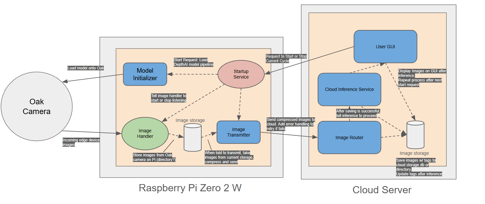

# ThirdEye Demo

This repo contains the edge and cloud services used for the ThirdEye hiking camera demo.

## Architecture



## What is implemented
- Cloud service container with cycle control + zip ingest + per-run metadata
- Edge service container with cycle control + bounded capture pipeline + upload flow
- Per-run directories with `metadata.json` and event logging

## What is left to complete
- Integrate Oak/DepthAI pipeline capture on edge
- Add inference pipeline on cloud and image tag updates
- Add authentication/shared secret between services
- Add cleanup policies and end-to-end reliability checks

## Usage (quick start)

Cloud service:
```
cd "cloud services/cloud-service"
docker build -t thirdeye-cloud .
docker run --rm -p 8080:8080 -v $(pwd)/data:/data thirdeye-cloud
```

Edge service:
```
cd "edge-services/edge-service"
docker build -t thirdeye-edge .
docker run --rm -p 8081:8081 -v $(pwd)/data:/data \
	-e CLOUD_INGEST_URL=http://localhost:8080/ingest \
	thirdeye-edge
```
